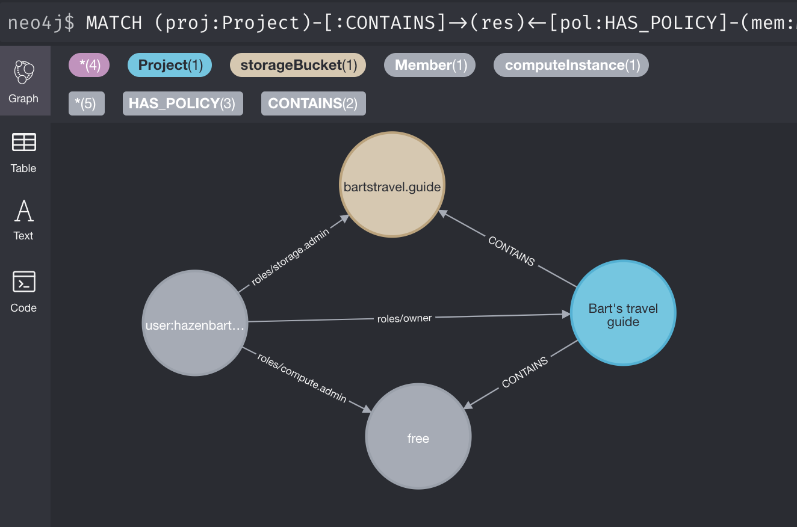
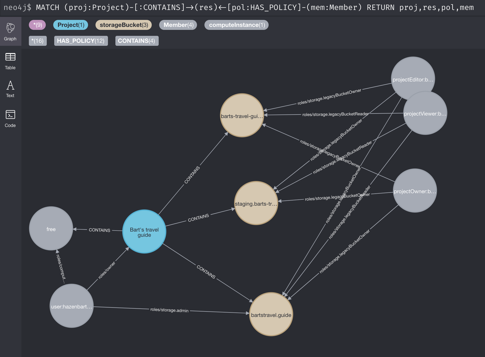

# GCP IAM visualisation

Provides an overview of the IAM policies set up in a Google Cloud Platform (GCP) project.
Links between assets and members are stored in a structured manner using neo4j. Relationships
between them can, as such, be analysed using the Cypher Query Language in the neo4j frontend.

## Getting started

The tool essentially makes APIs calls to determine the resources and IAM policies
set within a GCP project.

### Prerequisites

You must've installed the [Google Cloud SDK](https://cloud.google.com/sdk/docs/install).
Next to that, this tool will use your `gcloud` config to determine which project must be
analysed and which credentials must be used in order to do so. So be sure to have run the
following commands:

```bash
gcloud auth application-default login
gcloud config set project {{ project-name }}
```

### Clone repository

First, clone the repository to your machine.

```bash
git clone git@github.com:bartcode/gcp-iam-viz.git
cd gcp-iam-viz
```

### Install package

Create a virtual environment and install the tool.

```bash
python3 -m venv venv/
. venv/bin/activate
pip install .
```

### Set up neo4j

Run neo4j in Docker. The database (Postgres) in the backend does not use any
authentication.

```bash
docker-compose up -d
```

### Run ETL

The `iamviz` command runs the Python code in this repository to load data from
the Google APIs and load it in a structured manner into your local database.

```
iamviz
```

### Visualise results

Go to http://localhost:7474 and log in without credentials. This should show all
tags that are loaded from your GCP project.


## Example queries

### Show all policies for a single user

```cypher
MATCH (proj:Project)-[:CONTAINS]->(res)<-[pol:HAS_POLICY]-(mem:Member)
WHERE mem.email = "user:user@yourdomain.com"
RETURN proj,res,pol,mem
```



### Show all users with any kind of policy

```cypher
MATCH (proj:Project)-[:CONTAINS]->(res)<-[pol:HAS_POLICY]-(mem:Member)
RETURN proj,res,pol,mem
```


### Neo4j must-know
To show the role of an IAM policy as the caption of a relationship, click
`HAS_POLICY` under the query bar. Subsequently, click `<id>`, `<type>`, `<role>`,
or `<scope>` at the bottom of the visualisation to use it.

## Known limitations

- Only works on single projects. Haven't implemented to scan the entire organisational tree (yet).
- Only [searchable asset types](https://cloud.google.com/asset-inventory/docs/supported-asset-types#searchable_asset_types) are shown AND storage buckets.
